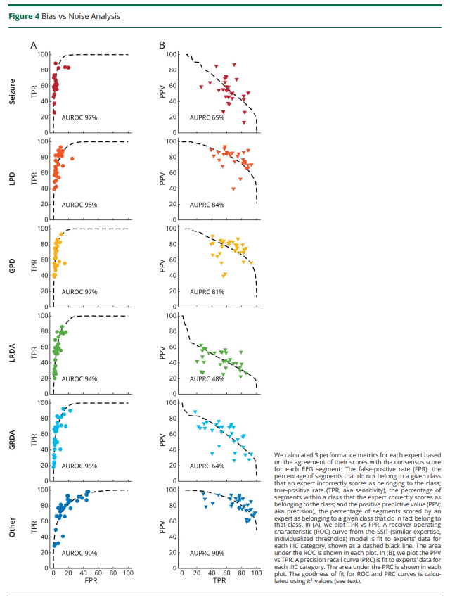

# IIIC-IRR

This repository provides code to reproduce figures in "Interrater Reliability of Expert Electroencephalographers Identifying Seizures and Rhythmic and Periodic Patterns in EEGs". 

## References and papers
Jing J, Ge W, Struck AF, Fernandes MB, Hong S, An S, Fatima S, Herlopian A, Karakis I, Halford JJ, Ng MC, Johnson EL, Appavu BL, Sarkis RA, Osman G, Kaplan PW, Dhakar MB, Jayagopal LA, Sheikh Z, Taraschenko O, Schmitt S, Haider HA, Kim JA, Swisher CB, Gaspard N, Cervenka MC, Rodriguez Ruiz AA, Lee JW, Tabaeizadeh M, Gilmore EJ, Nordstrom K, Yoo JY, Holmes MG, Herman ST, Williams JA, Pathmanathan J, Nascimento FA, Fan Z, Nasiri S, Shafi MM, Cash SS, Hoch DB, Cole AJ, Rosenthal ES, Zafar SF, Sun J, Westover MB. **Interrater Reliability of Expert Electroencephalographers Identifying Seizures and Rhythmic and Periodic Patterns in EEGs.** *Neurology*. 2023 Apr 25;100(17):e1737-e1749. doi: 10.1212/WNL.0000000000201670. Epub 2022 Dec 2. PMID: 36460472.

The [paper](IIIC_IRR.pdf)
The [supplemental material](IRR_IIIC_Supplemental.pdf)
[Commentary](IIIC_IRR_Commentary.pdf)

## Figures and Tables from Main Text
### Figure 1: Scoring flowchart.

In total, 124 raters (30 experts, and 94 technicians or trainees) scored 50,697 segments from 2,711 patients’ EEG recordings. The number of segments among these with consensus labels of seizure (SZ), lateralized or generalized periodic discharges (LPD, GPD), lateralized or generalized rhythmic delta activity (LRDA, GRDA), or none of those patterns (“Other”) are indicated. Constraints applied to ensure statistical stability for calibration analysis, pairwise inter-rater reliability (IRR) analysis, and majority IRR analysis are shown, together with the resulting number of experts’ data, and number of segments, are shown. For calibration analysis, the number of segments available is expressed as the median [minimum, maximum] number of segments per probability bin. For pairwise and majority IRR, the number of segments is given as the median [minimum, maximum] number of segments per pattern class. For pairwise IRR analysis, the number of expert pairs among the 30 experts with sufficient jointly scored data for analysis is also shown. 

### Figure 2: Examples of idealized patterns, proto-patterns, and edge cases. 

Selected examples of the idealized form of a pattern in the first column (A, E, I, L, O). These are patterns with uniform expert agreement. The second column (B, F, J, M, P) are proto or partially formed patterns. About half of raters labeled as one pattern and the other half labeled as “Other”. The third and fourth columns are edge cases (about half of raters labeled one pattern and half labeled the other pattern).  For B there is rhythmic delta activity with some admixed sharp discharges within the 10 second raw EEG, and the spectrogram shows that this segment may belong to the tail end of a seizure, thus disagreement between SZ and “Other” makes sense. F shows frontal lateralized sharp transients at ~1Hz, but they have a reversed polarity, suggesting they may be coming from a non-cerebral source, thus the split between LPD and “Other” (artifact) makes sense. J has diffused semi-rhythmic delta background with poorly formed low amplitude generalized periodic discharges with s shifting morphology making it a proto-GPD type pattern. M shows semi-rhythmic delta activity with unstable morphology over the left hemisphere, a proto-LRDA pattern. P shows a few waves of rhythmic delta activity with an unstable morphology and is poorly sustained, a proto-GRDA. C shows 2Hz LPDs showing an evolution with increasing amplitude evolving underlying rhythmic activity, a pattern between LPDs and the beginning of a seizure, an edge-case. D shows abundant GPDs on top of a suppressed background with frequency of 1-2Hz. The average over the 10-seconds is close to 1.5Hz, suggesting a seizure, another edge case. G is tied between LPD and LRDA. It shares some features of both; in the temporal derivations it looks more rhythmic whereas in the parasagittal derivations it looks periodic.  K is split between GPDs and GRDA. The ascending limb of the delta wave has a sharp morphology and there is asymmetry in slope between ascending and descending limb making it an edge case. N is split between GRDA and LRDA. The rhythmic delta appears to be of higher amplitude over the right, but there is some reflection of the activity on the left. H is split between LPDs and GPDs. The amplitude of the periodic discharges is higher over the right but a deflection is also seen on the left.  Note: Recording regions of the EEG electrodes are abbreviated as LL = left lateral; RL = right lateral; LP = left parasagittal; RP = right parasagittal. 

### Figure 3: Inter-rater reliability analysis (IRR)

(A) Calibration curves.  Segments were binned for each of the 6 classes according to the percentage of experts who classified them as that class. Bins were chosen to be 0-20%, 20-40%, 40-60%, 60-80%, and 80-100%. Calibration curves were calculated for each expert and each pattern class based on the percentage of segments within each bin that the expert classified as belonging to that class, producing a set of 5 percentages (one for each bin). A single parameter curve (see Supplemental S5) was fit to these percentages to characterize the experts' tendency to over- and under-call.  Experts with calibration curves >20% above the diagonal are considered over-callers. Experts with calibration curves >20% below the diagonal are considered under-callers. (B) Confusion matrices: These heatmaps show pattern of disagreement between experts for IIIC (and “Other”) classes. These are presented as conditional probabilities (between 0% and 100%). For the pairwise IRR confusion matrix (upper), the number in each square is the average (across pairs of experts) probability that a rater labels a pattern B (the x-axis) if another rater had labeled it Pattern C (the y-axis). The sum of values within each row is 100%. The matrices are not symmetric, because P(B|C) does not equal the P(C|B), as there are differences in the underlying prevalence of the patterns. The diagonal is the “Pattern” Pair-wise agreement shown in Table S4. For the majority IRR confusion matrix, the numbers are the average (across experts) probability that a rater labels a segment as pattern B (x-axis) if the majority label for that segment is C. 

### Figure 4: Bias vs noise analysis. 

We calculated three performance metrics for each expert based on the agreement of their scores with the consensus score for each EEG segment: The false positive rate (FPR): the % of segments that do not belong to a given class that an expert incorrectly scores as belonging to the class; true positive rate (TPR; aka sensitivity), the % of segments within a class that the expert correctly scores as belonging to the class; and the positive predictive value (PPV; aka precision), the % of segments scored by an expert as belonging to a given class that do in fact belong to that class. In (A), we plot TPR vs FPR. A receiver operating characteristic (ROC) curve from the SSIT (similar expertise, individualized thresholds) model is fit to experts’ data for each IIIC category, shown as a dashed black line. The area under the ROC is shown in each plot. In (B), we plot the PPV vs TPR. A precision recall curve (PRC) is fit to experts’ data for each IIIC category. The area under the PRC is shown in each plot. The goodness of fit for ROC and PRC curves is calculated using R^2 values (see text). 

### Table 1: Prior studies of expert inter-rater reliability for detecting seizures and IIIC events.

There is no code for this table. See paper. 

## Figures and Tables from Supplemental Material

### eTable 1
Summary information about EEG labeling rounds. 

### eTable 2: EEG labeling rounds. 
Summary information about numbers of EEG segments scored by experts.

### eTable 3: Numbers of EEG segments scored by experts.

### eFigure 1: Individual accuracy vs. number of samples scored.
Relationship between expert accuracy vs. number of samples scored.

### eFigure 2: Selected EEG examples. 

eFigure 2. Selected EEG examples. Rows are structured with the 1st row seizure, 2nd row LPDs, 3rd row GPDs, 4th row LRDA, and 5th row GRDA.  Column-wise, examples of idealized forms of  patterns are in the 1st column (A). These are patterns with uniform expert agreement. The 2nd column (B) are proto or partially formed patterns. About half of raters labeled these as one IIIC pattern and the other half labeled “Other”. The 3rd and 4th columns (C, D) are edge cases (about half of raters labeled these one IIIC pattern and half labeled them as another IIIC pattern). For B row 1 (B-1) there is rhythmic delta activity with some admixed sharp discharges within the 10 second raw EEG, and the spectrogram shows that this segment may belong to the tail end of a seizure, thus disagreement between SZ and “Other” makes sense. B-2 shows frontal lateralized sharp transients at ~1Hz, but they have a reversed polarity, suggesting they may be coming from a non-cerebral source, thus the split between LPD and “Other” (artifact) makes sense. B-3 has diffused semi-rhythmic delta background with poorly formed low amplitude generalized periodic discharges with s shifting morphology making it a proto-GPD type pattern. B-4 shows semi-rhythmic delta activity with unstable morphology over the right hemisphere, a proto-LRDA pattern. B-5 shows a few waves of rhythmic delta activity with an unstable morphology and is poorly sustained, a proto-GRDA. C-1 shows 2Hz LPDs showing an evolution with increasing amplitude evolving underlying rhythmic activity, a pattern between LPDs and the beginning of a seizure, an edge-case. D-1 shows abundant GPDs on top of a suppressed background with frequency of 1-2Hz. The average over the 10-seconds is close to 1.5Hz, suggesting a seizure, another edge case. C-2 is split between LPDs and GPDs. The amplitude of the periodic discharges is higher over the right, but a reflection is also seen on the left. D-2 is tied between LPDs and LRDA. It shares some features of both; in the temporal derivations it looks more rhythmic whereas in the parasagittal derivations it looks periodic. C-3 is split between GPDs and LRDA. The ascending limb of the delta waves have a sharp morphology, and these periodic discharges are seen on both sides. The rhythmic delta appears to be of higher amplitude over the left, but there is some reflection of the activity on the left. D-3 is split between GPDs and GRDA. The ascending limb of the delta wave has a sharp morphology and there is asymmetry in slope between ascending and descending limbs making it an edge case. C-4 is split between LRDA and seizure. It shows 2Hz LRDA on the left, and the spectrogram shows that this segment may belong to the tail end of a seizure, an edge-case. D-4 is split between LRDA and GRDA. The rhythmic delta appears to be of higher amplitude over the left, but there is some reflection of the activity on the right. C-5 is split between GRDA and seizure. It shows potentially evolving rhythmic delta activity with poorly formed embedded epileptiform discharges, a pattern between GRDA and seizure, an edge-case. D-5 is split between GRDA and LPDs. There is generalized rhythmic delta activity, while the activity on the right is somewhat higher amplitude and contains poorly formed epileptiform discharges suggestive of LPDs, an edge-case. Note: Recording regions of the EEG electrodes are abbreviated as LL = left lateral; RL = right lateral; LP = left parasagittal; RP = right parasagittal. 

### eTable 4: Expert Inter-rater reliability for IIIC events.

### eFigure 3: Component majority IRR matrices for 30 experts.

